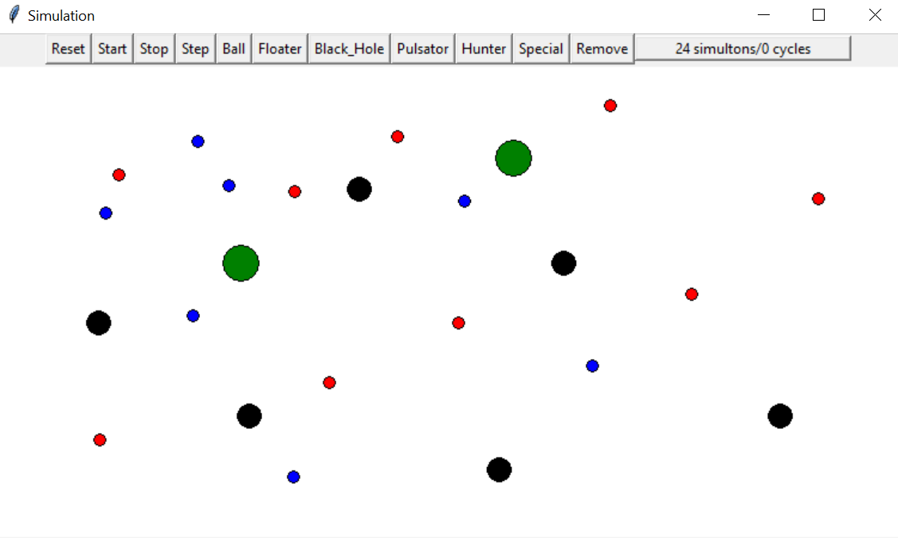

# InheritanceSimulation

This simulation was created to showcase the inheritance between objects. All objects inherit from a Simulton class, each with different characteristics, and some act as prey while others act as hunters.

Demo: https://youtu.be/gorzXEdg-2Q
